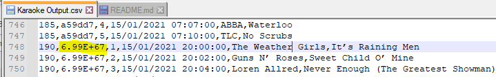

# Preppin' Data 2021 Week 8

This week, the big challenges were working with fractional seconds and non-equijoins. See the long explanation below, where I fell down a rabbit hole of parsing the Excel file's underlying XML!

Note for all methods: there were two numeric user IDs > 6 digits that were converted to scientific notation in the provided solution file (Karaoke Output.csv). I converted those user IDs so my output would match the solution, but obviously we wouldn't want to do that in practice! In this example, the Customer ID is a 67-digit number, which is larger than Excel's maximum precision of 15 (and Alteryx's 50).

## Python

## Alteryx - method 1 (ignoring fractional seconds)

This was one of the (extremely rare) challenges that I found to be easier in Python than in Alteryx, because handling fractional seconds and non-equijoins aren't standard functionality in Alteryx.

Upon initial investigation, it appeared that all of the customer and song times were rounded to the minute. In the first attempt, I handled the non-equijoin by creating a list of all minutes within each session (including the 10 min prior to each session), and then joined that to the customer's entry minute to find the customer's session.

However, this didn't quite match the solution.

Looking at customer 316313 in Python, we can see that the customer arrived at 20:00:00, but the session actually started slightly earlier at 19:59:59.971. Therefore, customer 316313 should not have been assigned to session #73.

The standard Alteryx Input tool is sensitive to the cell formatting in Excel. Here I edited the first five Dates in Excel to display fractional seconds. 

When the reformatted cells import into Alteryx, they import as numbers (number of days since 12/31/1899), from which the fractional seconds could be extracted. However, if cells are formatted as normal date/time, they are rounded to the nearest second when imported.

I experimented with checking the First Row Contains Data option to force all fields to be imported as strings, but that didn't seem to have any effect.

How can we solve this? Ideally, we would query the source system directly, or use a format where we have more control over the input (e.g. csv), or we could change the number format in Excel. In practice, though, we don't always have control over the input file, especially if it comes from a vendor. So, onto...

## Alteryx - method 2 (parsing xlsx XML)

Remembering that an .xlsx file is essentially a zip file containing XML files, and knowing that Alteryx has built-in tools to handle reading zip files and parsing XML, I explored that option. In the Input tool, I chose File Format = zip, and then selected the XML files to parse. In this case, we need three files: sheet1 (songs), sheet2 (customers), and sharedStrings, which contains any cell values that are strings.

Parsing the worksheet XML yields the cell address (r2 field) and the contents (v field). If the cell value is a string, then [t]='s', and [v] contains the string number. If the cell value is a number, then [v] contains the value.

We can then join the string # to the parsed sharedStrings output to get the values for the string cells and then transpose into a table. Now the date field is a more precise numeric value that we can use for joining customers to sessions.

Since we can't do a non-equijoin in Alteryx, I found the min timestamp per session (one row per session), and then cross joined that to the customer list. Customers arriving after the session start or more than 10 minutes before the session start were filtered out.

